<p align="center">
  
</p>

<h1 align="center">Aetheria</h1>

<p align="center">
  <strong>Automated social media scheduling and analytics suite for content creators.</strong><br />
  Draft once, publish everywhere on schedule, and read the impression curves that tell you when to post next.
</p>

<p align="center">
  
  
  
  
  
  
  
  
</p>

<p align="center">
  <code>social-media-scheduler</code> &nbsp;
  <code>saas</code> &nbsp;
  <code>nextjs</code> &nbsp;
  <code>mongodb-aggregation</code> &nbsp;
  <code>cron-worker</code> &nbsp;
  <code>oauth</code> &nbsp;
  <code>stripe</code> &nbsp;
  <code>analytics</code>
</p>

---

## What it is

Aetheria is a full stack SaaS built around one loop: **draft, schedule, auto publish, learn.**
Content creators write a message once, Aetheria forks a per network variant, a cron worker
publishes it at the chosen time, and metric snapshots stream into MongoDB aggregation
pipelines that surface impression growth, engagement rate and the best times to post.

It runs with **zero configuration**. With no environment variables it boots in demo mode on a
seeded 90 day dataset. Add a `MONGODB_URI`, Stripe keys, Cloudinary credentials or social OAuth
apps and each subsystem switches to live, one at a time.

## Highlights

| Area | What is inside |
| --- | --- |
| **Aether Composer** | One editor, live per network previews, animated character count rings, hashtag and mention highlighting, media drop zone |
| **The Dial** | A radial 24 hour clock for today and a constellation week grid, tap any signal to reschedule |
| **Optimal Time Halo** | Golden posting windows computed from your own engagement history, overlaid on the composer |
| **Signal Queue** | Every upcoming auto publish with a live countdown, status pulse, retry and cancel |
| **Aurora Analytics** | Impression growth with a 7 day moving average, engagement rate per network, a 7 x 24 timing heatmap and a cadence score |
| **Token Vault** | OAuth tokens encrypted at rest with AES-256-GCM, refreshed automatically before they lapse |
| **Billing Nebula** | Stripe checkout, the customer portal and a webhook driven subscription lifecycle, with a demo simulate path |

Plus an animated aurora logo, a mouse reactive particle field, a themed control kit
(scrollbar, odometers, dropdowns, sliders, an orrery date picker), a command palette and a
global reduce motion switch.

## The analytics engine

Every dashboard number comes from a MongoDB aggregation pipeline in
[`lib/analytics/pipelines.ts`](./lib/analytics/pipelines.ts):

- **Impression growth**: `$dateTrunc` into local day buckets, `$densify` to fill gaps,
  then `$setWindowFields` for a 7 day moving average and a day over day growth rate.
- **Engagement rate**: a single `$facet` returns the per network breakdown and the
  rolled up total in one pass.
- **Optimal timing**: `$dayOfWeek` and `$hour` with a timezone argument build a 7 x 24
  grid of average engagement, the top cells become golden windows.
- **Cadence score**: `$setWindowFields` with `$shift` measures the gap between
  consecutive publishes, `$bucketAuto` correlates gap length with outcome.

In demo mode the exact same shapes are produced by equivalent reducers over the fixture data,
so the UI never knows the difference.

## Architecture

```
Next.js 16 App Router (one Vercel project)
  app/(marketing)      landing, pricing
  app/(auth)           sign in and sign up   -> JWT in an httpOnly cookie (jose + bcrypt)
  app/(studio)         the product            -> overview, composer, dial, queue, analytics, channels, billing, settings
  app/api/cron/*        publish (every minute), refresh (hourly), metrics (every 6h)
  app/api/webhooks/stripe   subscription lifecycle
lib/
  data/                repository interface with { live | demo } implementations
  queue/               atomic job claim via findOneAndUpdate, retry with exponential backoff
  social/              per network adapters, real HTTP or a deterministic mock
  analytics/           the aggregation pipelines and their demo equivalents
  crypto.ts            AES-256-GCM for stored tokens
  stripe.ts            checkout, portal, webhook verification
models/                Mongoose schemas: User, Account, Post, Metric, Subscription
```

The scheduling worker is deliberately serverless friendly. Jobs are claimed atomically before
any network call, a stale lock older than five minutes can be reclaimed, and failures back off
across 1, 5, 15 and 60 minute retries. The queue module is adapter shaped, so BullMQ or
Agenda.js could drop in behind the same interface.

## Tech stack

- **Next.js 16**, React 19, TypeScript, Turbopack
- **Tailwind CSS v4** with a custom token system
- **MongoDB** with Mongoose, aggregation pipelines for analytics
- **Framer Motion** and **Lenis** for motion, hand built **d3-scale / d3-shape** charts
- **jose** and **bcryptjs** for auth, **Stripe** and **Cloudinary** SDKs
- Deploys to **Vercel** with native Cron Jobs

## Getting started

```bash
git clone https://github.com/Abudora-0/Aetheria.git
cd Aetheria
npm install
cp .env.example .env.local   # optional, everything works without it
npm run dev
```

Open http://localhost:3000. Sign in with the demo account shown on the sign in screen
(`demo@aetheria.app` / `aurora`).

### Going live

```bash
# populate a real database with a 90 day history
MONGODB_URI="mongodb+srv://..." npm run seed

# verify the aggregation pipelines against it
MONGODB_URI="mongodb+srv://..." npm run pipelines:check
```

Set `MONGODB_URI` (and optionally `DATA_MODE=live`) and the app reads from MongoDB. Add the
other keys from `.env.example` to enable Stripe, Cloudinary and each social network.

## Deploying to Vercel

1. Push this repo to GitHub and import it at [vercel.com/new](https://vercel.com/new).
2. Add environment variables from `.env.example` as needed. `CRON_SECRET` is required in
   production, the rest are optional.
3. Deploy. `vercel.json` registers three cron jobs:

   | Path | Schedule | Job |
   | --- | --- | --- |
   | `/api/cron/publish` | `* * * * *` | claim and publish due signals |
   | `/api/cron/refresh` | `0 * * * *` | refresh OAuth tokens near expiry |
   | `/api/cron/metrics` | `0 */6 * * *` | pull fresh engagement snapshots |

   On the Hobby plan, adjust the publish schedule to the allowed frequency or trigger the
   worker from the Signal Queue.

## Environment variables

| Variable | Purpose | Without it |
| --- | --- | --- |
| `MONGODB_URI` | MongoDB connection string | in-memory demo dataset |
| `JWT_SECRET` | signs the session cookie | a development default |
| `TOKEN_ENC_KEY` | encrypts stored OAuth tokens | tokens stored reversibly, dev only |
| `CRON_SECRET` | authorizes Vercel Cron calls | cron open in dev, blocked in prod |
| `CLOUDINARY_*` | media uploads | deterministic placeholder images |
| `STRIPE_*` | billing | the simulate billing path |
| `<NETWORK>_CLIENT_ID` / `_SECRET` | live OAuth and publishing | a sandbox adapter per network |

## Scripts

| Command | Description |
| --- | --- |
| `npm run dev` | start the dev server |
| `npm run build` | production build |
| `npm run seed` | seed a MongoDB database with demo history |
| `npm run pipelines:check` | run the aggregation pipelines and print their output |
| `npm run lint` | lint the project |

## Roadmap

- Drag to reschedule on The Dial
- Thread and carousel composition
- Team workspaces and roles
- Webhook out for publish events
- More networks: Mastodon, Bluesky, Threads, YouTube Community

## License

[MIT](./LICENSE)
